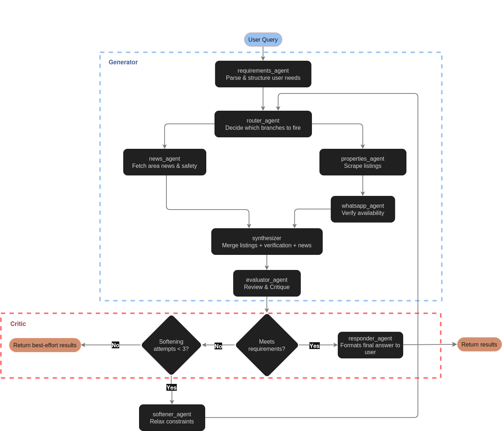

<p align="center">
  
</p>

# Casana

Autonomous multi-agent system for real estate acquisition. Agents search listings across multiple sources, verify availability, evaluate properties against user requirements, and iteratively refine results — all without human intervention.

> [!IMPORTANT]
> Casana is currently in **early development**. APIs, prompts, and agent orchestration flows may change frequently.

## Architecture

This repo contains multiple building blocks that power Casana.

<p align="center">
  
</p>

## Agents

| Agent | Responsibility |
|---|---|
| `requirements_agent` | Parses user input into a structured requirements object; loops for clarification if needed |
| `router_agent` | Determines which branches to activate based on requirements; stateless and deterministic |
| `properties_agent` | Scrapes real estate listing sites (Finca Raíz, Metrocuadrado, etc.) for matching properties |
| `news_agent` | Fetches area news relevant to the search zone (security, infrastructure, market trends) |
| `whatsapp_agent` | Contacts listed phone numbers to verify each property is still available |
| `synthesizer` | Merges and deduplicates outputs from the parallel agents into a unified candidate set |
| `evaluator_agent` | Scores candidates against requirements; decides pass, retry, or give up |
| `softener_agent` | Relaxes requirement constraints incrementally when evaluation fails; increments retry counter |


## Quick start 🚀 

```bash
# Install dependencies
uv sync

# Configure environment
cp .env.example .env
# Edit .env with your API keys

# Run
uv run src.main
```

## WhatsApp verification (optional)

`whatsapp_agent` reaches out to brokers via a local [EvolutionAPI](https://github.com/EvolutionAPI/evolution-api) gateway to confirm that the top-scoring listings are still available. It is **off by default** — set `WHATSAPP_ENABLED=true` in `.env`, or pass `whatsapp_enabled=True` in the graph state per run.

```bash
# Start the local Evolution stack (Postgres + Redis + Evolution API)
docker compose -f docker-compose.evolution.yml up -d

# Open http://localhost:8080/manager and scan the QR for instance $EVOLUTION_INSTANCE
# (default: Casana) with the WhatsApp account you want to send from.
```

The agent only contacts candidates with `match_score >= 0.70`, capped at the top 3 by score, and adds a randomized 3–8 s delay between sends as a basic anti-ban measure. 
